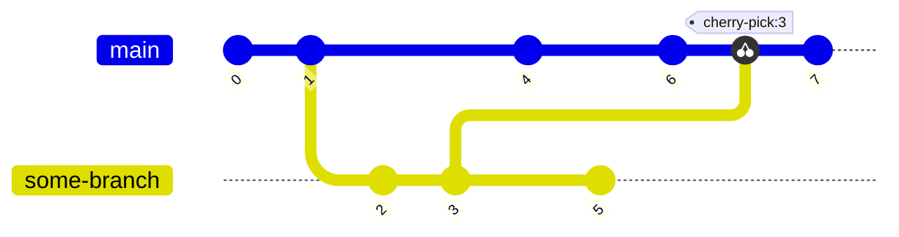
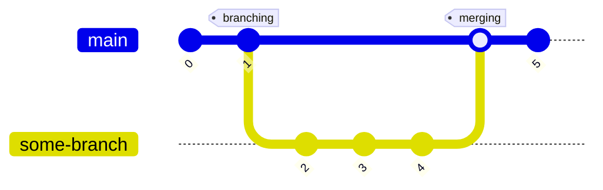
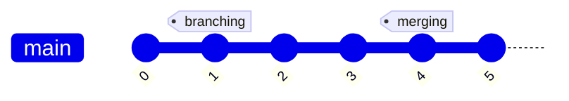
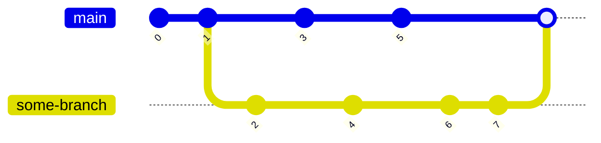

# Managing branches

In this section, we will discover what a branch is, how to manage them and the most usual techniques to port
modifications from one branch to another.

We have been using branches from the beginning of this tutorial, as `main` is indeed a branch. By convention,
`main` is the first and central branch in a Git repository. It was historically called `master` but was changed in
recent years. And going back further in time, in `SVN` the main branch was called `trunk`, hence the expression *trunk
based development*.

## What is a branch?

Before presenting what a branch is, we first need to introduce the concept of `reference`. So far we have identified
commits only by their hash number. This is the default way of identifying different modifications. But there are other
ways of identifying a single commit or a chain of commits (as in a succession of commits, *a.k.a.* a branch).

A reference is a label attached to a commit. If you think programmatically, a reference is just a pointer to a value
(the hash of the commit it points to). The two main references types are `branches` and `tags`. Branches and tags are
very similar, with one major difference: a tag is a reference attached to a single commit in history and will not
change. A branch is a reference to the latest commit on a chain and will be updated after every commit made on said
branch. 

There is a special reference named `HEAD` which points to the last commit of the current branch. `HEAD` can be used just
like any other reference. It also allows you to reference previous commits. For instance:

```shell
git show HEAD     # Shows the latest commit on the current branch
git show HEAD~1   # Shows the second to last commit on the current branch
git show HEAD~n   # Shows the nth previous commit on the current branch
```

References can be created at any point in time, referring to any commit in history. References can be created from
other references and so on, and references can be deleted. One thing to remember is that references are always created
locally. If you want to share references, you will need to explicitly push them to a remote. This also applies if you
want to delete a reference.

References are stored in `.git/refs`. It contains a hierarchy of folders, with at the end files that contains the hash
of the commit it points to.

Before diving into the specifics, there is one special command that is worth mentioning. `reflog` lets you access
almost everything you have done on a repository (be that a commit, merge or pull for instance). It acts as a history
of the local repository and gives you the option to access said history. This might be particularly helpful in case
something very bad happen during a merge.

## Creating a branch

Let's take a look at how to create tags and branches, stating with the former.

### Working with tags

As mentioned in the previous section, a tag is immutable. Once created it will always point to the same commit. For
this reason, they are mostly used to keep track of the state of the repository at a given point in time. For instance,
it can be quite useful to tag releases.

The `tag` command is used for most operations related to tags, starting by listing them. With no options or arguments
the command will list all existing tags.

There are two types of tags: `annotated tags` and `lightweight tags`. Annotated tags are created with a tagging message
and will store some information, including the date and the identity of the author. Lightweight tags will only store the
hash of the commit it refers to and nothing else.

Tags can be created retrospectively, you do not need to be at the commit you want to tag. Doing so only requires a
commit hash or another reference when creating the tag.

The tag command will create local tags. To share them with a remote, you will need to `push` them. After it has been
pushed, anyone who pulls from the repository will have access to the new tags. Tags deletion works in a similar fashion.
You need to delete tags locally and remotely with separate commands.

```shell
git tag                                       # List existing tags
git tag -l "<regex>"                          # List existing tags matching the given regular expression
git tag -a <name> -m <message>                # Create an annotated tag at the current position with the given message
git tag -a <name>                             # Create an annotated tag at the current position, will prompt for a message
git tag -a <name> -m <message> <hash or ref>  # Create an annotated tag at the given position with the given message
git tag <name>                                # Create a lightweight tag with the given name
git push <remote> <name>                      # Push the given tag to the given remote
git push <remote> --tags                      # Push all tags to the given remote
git tag -d <name>                             # Delete a local tag
git push <remote> --delete <name>             # Delete a remote tag 
```

### Working with branches

Working with branches is quite similar to working with tags. You create them locally, have to manually push the branch
to a remote, and delete them in a similar fashion.

Listing branches is done with the `branch` command. This gives you the option to list local branches and view the remote
branches they are tracking, if any.

To work with branches, we use the `switch` command. Historically this was done with the `checkout` command, so we will
mention it here too because many online resources still mention it. Though you should get use to using `switch` as this
is the Git recommended command for branch manipulation.

Without any option, `switch` is used to switch between branches. It takes a branch name as argument, and will update
the local copy to the HEAD of said branch. You can also specify a tag or the hash of any commit in history, but to do
so you have to specify the `--detach` option. This will put you in the *detached HEAD* state, this means you are
currently not attached to any branch. If you commit now, the commit will not be attached to any branch and thus be lost.
If you want to switch back to an old commit and start committing from there, you need to create a branch form this
point.

To create a branch, you need the `-c` option. This will either create a branch at the current commit, or create a branch
at the given reference or commit. This allows you to go back in time and avoid the *detached HEAD* state.

Remember that references are by default local only, you will need to push them if you want to share them. this is done
with the `push` command, exactly as we saw for tags. Once the local branch is pushed for the first time and thus
tracking the newly created remote branch, you can use `push` and `pull` without any options, it will automatically
access the remote branch that the local branch is tracking.

Deleting is again similar, you can delete a local branch with the `branch -d` command and delete a remote branch with
the `push --delete` command.

```shell
git branch                              # List all local branches
git branch -v                           # List all local branches, specifying last commit hash and message for each branch
git branch -vv                          # Same as previous command, also specify the remotes branches they are tracking
git switch <branch>                     # Switch to the given branch
git checkout <branch or tag>            # Idem, but also work with tag/hash. Will put you in detached HEAD state for tags/hashes
git switch <hash> --detach              # Switch to the given hash in detached HEAD state
git switch -                            # Switch back to previous branch
git checkout -                          # Idem
git switch -c <name>                    # Create a branch at the current commit
git checkout -b <name>                  # Idem
git switch -c <name> <ref>              # Create a branch at the given branch/tag/commit
git checkout -b <name> <ref>            # Idem
git push --set-upstream <remote> <name> # Create a remote branch with the given name from the current HEAD
git push -u <remote> <name>             # Short version of the previous command
git branch -d <name>                    # Delete the local branch, only works if fully merged
git branch -D <name>                    # Delete the local branch, force the deletion even if not fully merged
git push --delete <remote> <name>       # Delete the remote branch
```

## Cherry-picking

Cherry-picking is a simple way of moving commits across branches. They are mostly useful in simple use cases such as
hot fixes or bringing back to main the subset of a prototype branch.

The `cherry-pick` command is used with a single argument, the hash of the picked commit. The commit will be taken 
*as-is* and applied at the top of the current branch, but will generate a new commit hash that uniquely identifies this
new commit. As with every command that move commit across branches, cherry-pick can lead to merge conflicts.

In the following example, a branch is created after commit `1`, then both branches evolve in different directions. Then
commit `3` is cherry-picked from the second branch and applied to `main`.



The following listing describes how to use the `cherry-pick` command.

```shell
git cherry-pick <hash>
```

## Merging

At first sight, merging can look quite a daunting task, but there are tools and techniques to help. 

Let's first talk about different merging techniques. They can be grouped in two categories: *fast-forward* and
*three-way* merges. Fast-forward merges are simpler and allow one to keep a linear history. Three-way merges are
intrinsically harder to do as both branches have evolved differently and might require solving conflicts.

Merging branches is done with the `merge` command. By default, it takes a branch as the argument, and will merge said
branch to the current one. Merging is only possible if the working copy is clear, meaning there cannot be modified or
uncommitted files. You either need to commit said changes, stash them or revert them.

The following listing describes how to use the `merge` command.

```shell
git merge <branch>   # Merge given branch to with the current one
```

### Fast-forward merge

A fast-forward merge is possible when the branch to merge is further in history than the destination branch. This is for
example the case if you branch from main, do a few commits and then want to merge back to main while main has not
changed. In that case, Git is smart enough to move the reference of the destination branch to the commit of the target
branch. This will combine the histories of both branches into one, effectively maintaining a linear history. The commits
will be kept untouched, as no modifications are necessary. No conflicts can happen as the branches have not diverged.

If the destination branch have changed, a fast-forward merge is still possible, but requires first a `rebase`. If both
branches have evolved from the branching point, you can first rebase the target branch onto the destination branch. This
will in re-apply all commits from the target branch onto the destination branch, one by one in chronological order. As
both branches have changed, conflicts might happen. Git can automatically solve simple conflicts, but not always. In
that situation, the rebase will stop at the conflicting commit and prompts you to solve the conflict by hand before
continuing. You will need to edit the incriminated files, mark them as *solved* (with the `add` command) and then tell
Git to continue the rebase. Doing so will generate a new commit (as files have been modified in the process) and the
subsequent commits will also be re-generated, as they will then be based on a different commit. During a rebase, each
individual commit can create conflicts and will have to be solved individually. This is actually a good thing, as it is
easier to solve multiple small conflicts than a big one.

The following listing describes how to use the `rebase` command.

```shell
git rebase <branch>       # Rebase given branch on top of the current branch
git add <files>           # Once conflicts have been manually solved, you need to add incriminated files
git rebase --continue     # Once conflicts are solved and files added, tell git to continue the rebase
git rebase --abort        # When a conflict happens, you can abort the whole process
```

In the following example we illustrate how branches are merged together. Though this situation does not illustrate a
*fast-forward* merge, as we can see both branches are kept and a merge commit is created. This is often referred to as
a *bow-shaped* branch. To obtain this result, we need to tell Git explicitly we do not want to *fast-forward*. This is
done with the `--no-ff` option.



Without the `--no-ff` options the merge will be fast-forwarded, as is illustrated in the following example. The branches
are exactly the same as the previous example. The tags are here to help visualise which commit is the starting point and
which is the merge commit.



### Three-way merge

Three-way merges are what happens when both branches have evolved in different directions. In such case, Git will try to
merge the two branches into one, generating a new merge commit unifying both branches. Any subsequent commit will then
belong to the destination branch. When merging, Git will try to solve conflicts automatically but will stop the merge
and prompt you to solve the conflicts before continuing, similarly to what happen during a rebase.

As the merging happens at once, this is often referred to as a *big-bang merge*. This is illustrated in the following
diagram, where we can see that `some-branch` was branched at commit `1`. Then both `main` and `some-branch` evolved in
different direction before being merged back to main after commits `5` and `7`. A new commit is generated for the merge.



The following listing describes the most common merge commands.

```shell
git merge <branch>       # Merge given branch to the current branch
git add <files>          # Once conflicts have been manually solved, you need to add incriminated files
git merge --continue     # Once conflicts are solved and files added, tell git to continue the merge
git merge --abort        # When a conflict happens, you can abort the whole process
```

## How did we get here?

Let's take a quick look at the command that were run to produce this section. To avoid cluttering the listings, I
omitted all commands related to logging and viewing differences.

The first listing describes commits done on main before any branches or tags were introduced.

```shell
git add -p
git add sections/branching.md
git commit -m "Describe what is a reference"
git push
git commit -m "Add 'how did we get here' section in branching" sections/branching.md
git push
```

The second listing describes how to create a tag, a branch and do a fast-forward merge.

```shell
git tag -a start-branching -m "Starting point for the exercises related to branching and merging"
git switch -c create-branches
git push origin start-branching
git commit -am "Section on tags"
git push --set-upstream origin create-branches
git commit -am "Section on creating/deleting branches"
git push
git commit -am "Update listing"
git push
git switch main
git merge create-branches
git push
```

The third listing describes how to cherry-pick from another branch.

```shell
git switch -c cherry-picking start-branching
git commit -am "Useless commit"
git push
git push --set-upstream origin cherry-picking
git commit -am "Section on cherry-picking"
git commit -am "Another useless commit"
git push 
git switch main
git cherry-pick 957d875
git add -u                  # After solving the conflict
git cherry-pick --continue  # To mark the conflict as solved
git push
```

The forth listing describes how to perform a three-way merge.

```shell
git switch -c merging-branches start-branching
git push --set-upstream origin merging-branches
git commit -am "Section on fast-forward merge"
git push
git commit -am "Section on three-way merge"
git push
git switch main
git merge merging-branches
git add -u                # After solving the conflict
git merge --continue      # To mark the conflict as solved
git push
```