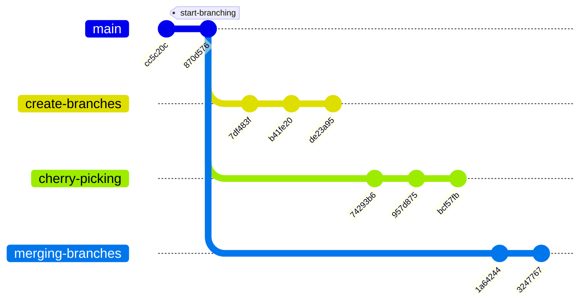

# Exercises

In this section, we will practice what we have learned in the previous sections by working on an exercise based on this
very repository.

## Starting point

The following diagram represents the starting point of the exercise. We can see the last two commits on the `main`
branch before branching, with the `start-branching` tag created to make it easy to navigate and visualise. From there
three branches have been created: `create-branches`, `cherry-picking` and `merging-branches`. The hashes in the diagram
are the actual hashes of the commits in the repository, they can be used as well as the branch and tag references to
manipulate the history.



## Instructions

To start the exercise, you will need to clone the repository onto your machine and navigate to the working copy. From
there, the recommended option is to create a new local branch to play with. The required commands are summarised in the
following listing.

```shell
git clone git@github.com:belarte/git-tutorial.git
cd git-tutorial
git switch -c my-branch start-branching
```

From there you will do the following, in no particular order:

- Port the content of `create-branches` to `my-branch` (three commits)
- Port the content of `merging-branches` to `my-branch` (two commits)
- Port commit `957d875` from `cherry-picking` to `my-branch` (one commit)

You will most likely have conflicts when doing the exercise. There will be quite straight forward to solve. Take your
time, do not hesitate to abort and analyse the problem before starting over.

There are multiple ways to solve this problem, as we have seen in previous sections. You can choose *three-way* merges
or *fast-forward* merges, or even both. You can choose to use cherry-pick or not. You can rebase first or not.

If this exercise sounds too easy for you, you can challenge yourself by adding constraints. For example, you might want
to end up with a linear history, choose not to use a given command, or choose to use only a single one. Your imagination
is the limit!

Please note this repository is private, so you will not be able to push code or play with remote branches. If you want
to do so, you can fork the project on GitHub. Or alternatively you can create a bare repo on your own, add it as a
remote to your local checkout of the tutorial and start having fun!
